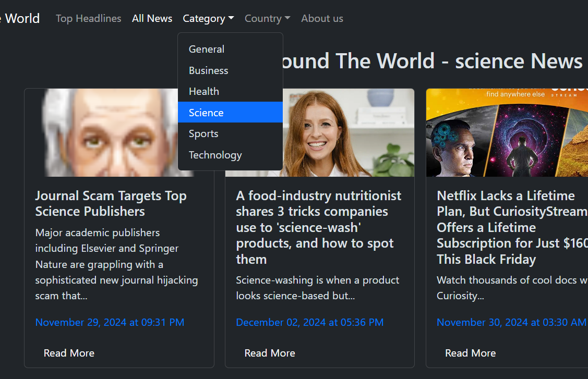

# Around-The-World (A NEWS App)

> **Note:** This app is not live because the news API charges for deployed projects. Hence, it is a localhost-based web application.

## 📌 Overview
Around-The-World is a news application that provides top headlines and news from around the world. Built with ReactJS and Redux, this app allows users to browse the latest news by category and explore various topics.

## 🖼️ Screenshots
Below are placeholders for the sample images. Replace them with your own screenshots:

- **Home Page:** <br>
- **Category wise News:** <br>
- **Top-Headlines country wise:** <br>

## ✨ Features
- Fetches top headlines and global news.
- Allows users to filter news by category.
- User-friendly and responsive design.
- Built using React, Redux, and Bootstrap CSS.

## 🚀 Installation Guide

To run the app locally, follow these steps:

### Prerequisites
- Node.js (v14 or above)
- npm (Node Package Manager)

### Steps

1. **Clone the Repository:**
   ```bash
   git clone https://github.com/yourusername/around-the-world.git
   cd around-the-world
   ```

2. **Install Dependencies:**
   ```bash
   npm install
   ```

3. **Add API Key:**
   My API key added already please use it as sample viewing purpose only.

4. **Run the Application:**
   ```bash
   npm run dev
   ```
   Most probably - This will start the app on `http://localhost:5173`.
   or else click on provided localhost address in the terminal.

## 🛠️ Technologies Used
- ReactJS
- Redux Toolkit
- Bootstrap CSS
- Axios
- Vite

## 🤝 Contributing
Contributions are welcome! Please follow these steps:

1. Fork the repository.
2. Create a new branch (`git checkout -b feature/YourFeature`).
3. Commit your changes (`git commit -m 'Add your feature'`).
4. Push to the branch (`git push origin feature/YourFeature`).
5. Open a Pull Request.


## 🧑‍💻 Author
- **Naresh**

If you have any questions or suggestions, feel free to contact me via [GitHub](https://github.com/ns2511).

---

Enjoy using **Around-The-World**! 🌍
